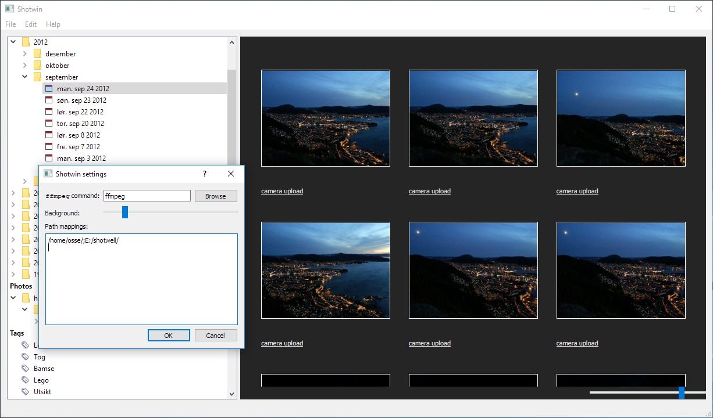

# Shotwin

[Shotwell](https://wiki.gnome.org/Apps/Shotwell) is an awesome image organizer.
However, there is no Windows port. Shotwin reads a Shotwell database and
provides a user interface similar to Shotwell:

The target platform is Windows, but (at least currently) it is as
cross-platform as Qt is. The idea behind it is simple

1. Copy Shotwell's database and all the files in it's database to a readable
   location on Windows.
2. Add as many path mappings as needed in the Settings dialog. E.g.,
   `/home/osse/Picture;E:/shotwell` makes Shotwell attempt to find images under
   `E:/shotwell` when it encounters a path starting with `/home/osse/Pictures`
   in the database. This is in fact the only mapping I personally need, but you
   can add as many as you want. They are tried in order.
3. Enjoy! (Potentially after restarting)

## Motivation:

I've Shotwell for several years. But the last couple of years Windows has been
my most-used desktop OS at home. Firstly, it because tedious to either use a
Virtual Machine or reboot to look at my pictures. Secondly, I wanted to
familiarize myself with some aspects of Qt I wasn't all that familiar with, in
particular Qt's [Model/View
Framework](http://doc.qt.io/qt-5/model-view-programming.html) and
[QML](https://doc.qt.io/qt-5.10/qtqml-index.html). Thus, Shotwin was born.

It is **not** meant as a _fork_ of or generally competitor to Shotwell. Neither
is it meant to be a _port_ of Shotwell. It is simply a program that uses a
Shotwell database.

## Features

Currently, Shotwin has the following basic features of Shotwell:

- Events organized in a tree, with event names or dates,
- file system tree of photo locations (does not current use the mapping
  describe above),
- tags list,
- basic view of events or photos within an event, when using the left-hand side trees,
- display rating and tags when viewing photos
- "fullscreen" photos with keyboard navigation.

It does not support:

- image transformations,
- searching,
- modification (importing photos etc.),
- modifiable sorting,
- nice rounded corners in the list of events,
- and just about everything else.

Some quirks:

- The GUI design looks very bland for a modern app. This has been far down on
  my list priorities, so don't hold your breath.
- Localized dates everywhere, but otherwise English language used in the GUI.
- No nice rounded corners in the list of events.

However, it does:

- Show thumbnails of videos!
- Play videos without using an external player!

## Building

Shotwin is written in C++ with Qt and has no other compile time dependencies.
The build system is CMake. If you are familiar with CMake building should be
straight-forward. I have successfully built it with both Qt as provided by
MSYS2 and the official installer.

To make thumbnailing of videos work, you need `ffmpeg`, and it must either be
in `%PATH%` or you can set the path to it in the settings. To make video
playback work, you need...
